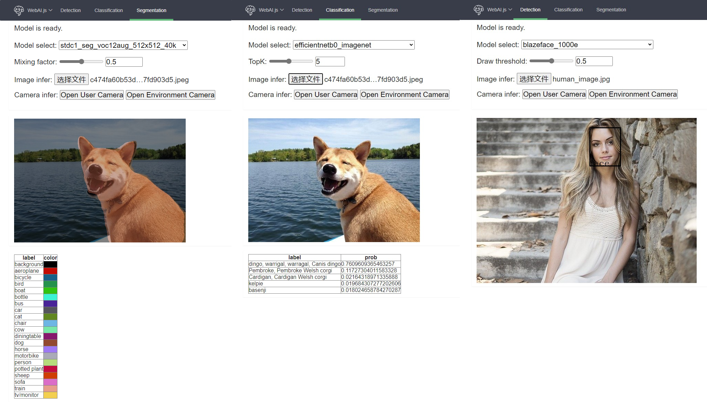

# WebAI.js
## Online Demo
* [Hello WebAI.js](https://AgentMaker.github.io/WebAI.js)

    

## Features
* Multi-type CV model support

    * [x] Detection models (SSD / YOLO / FCOS / PPYOLO / ...)
    * [x] Classification models (MobileNet / EfficientNet / PPLCNet / ...)
    * [x] Segmentation models (BiseNet / PPSeg / STDC / ...)
    * [ ] OCR models (PPOCR / ...)
    * [ ] more (...)

* Multi-type common CV preprocess OPs support

    * [x] Resize
    * [x] Center Crop
    * [x] Normalize
    * [ ] more (...)

* Rapid deployment of models trained using toolkits

    * [x] [PaddleDetection][PaddleDetection]
    * [x] [PaddleClas][PaddleClas]
    * [x] [PaddleSeg][PaddleSeg]
    * [ ] more (...)


## Requirements
* [OpenCV.js](https://docs.opencv.org/4.5.5/d5/d10/tutorial_js_root.html)
* [ONNXRuntime](https://github.com/microsoft/onnxruntime)

## Usage
* More detailed usage documents and example programs will be updated soon

### Use WebAI.js in a html script
* Install

    ```html
    <!-- Github -->
    <script src='https://cdn.jsdelivr.net/gh/AgentMaker/WebAI.js/dist/webai.min.js'></script>

    <!-- Npm -->
    <script src='https://cdn.jsdelivr.net/npm/webai-js/dist/webai.min.js'></script>
    ```

### Use WebAI.js in node.js
* Install

    ```shell
    $ npm install webai-js
    ```

* Face detection

    ```js
    const WebAI = require('webai-js')
    async function run() {
        let modelURL = './docs/pages/pretrained_models/det/blazeface_1000e/model.onnx'
        let modelConfig = './docs/pages/pretrained_models/det/blazeface_1000e/configs.json'
        let onnxBackend = 'node'
        let drawThreshold = 0.5

        let model = await WebAI.Det.create(modelURL, modelConfig, onnxBackend);
        let image = await WebAI.loadImage('./docs/images/human_image.jpg');
        let results = await model.infer(image, drawThreshold)

        console.log(results)
    }
    run()
    ```
        [
            {
                label: 'face',
                color: [ 0, 0, 0, 255 ],
                score: 0.9996205568313599,
                x1: 330,
                y1: 28,
                x2: 418,
                y2: 139
            }
        ]

## Model Zoo
* The following pretrained models are provided in the project, and you can quickly try them on the [online experience website](https://AgentMaker.github.io/WebAI.js)
* The pretrained model files can be found in [./docs/pages/pretrained_model](./docs/pages/pretrained_model) directory
* More pretrained models will be added continuously
* The export method of the model will also be updated in the document in the future


    |Model|Type|source|
    |:-:|:-:|:-:|
    |BlazeFace_1000e|Detection|[PaddleDetection][PaddleDetection]|
    |PPYOLO_tiny_650e_coco|Detection|[PaddleDetection][PaddleDetection]|
    |SSD_mobilenet_v1_300_120e_voc|Detection|[PaddleDetection][PaddleDetection]|
    |SSDLite_mobilenet_v3_small_320_coco|Detection|[PaddleDetection][PaddleDetection]|
    |EfficientNetB0_imagenet|Classification|[PaddleClas][PaddleClas]|
    |MobileNetV3_small_x0_5_imagenet|Classification|[PaddleClas][PaddleClas]|
    |PPLCNet_x0_25_imagenet|Classification|[PaddleClas][PaddleClas]|
    |PPSEG_lite_portrait_398x224|Segmentation|[PaddleSeg][PaddleSeg]|
    |STDC1_seg_voc12aug_512x512_40k|Segmentation|[PaddleSeg][PaddleSeg]|
    |BiseNet_cityscapes_1024x1024_160k|Segmentation|[PaddleSeg][PaddleSeg]|

[PaddleDetection]:https://www.github.com/PaddlePaddle/PaddleDetection
[PaddleClas]:https://www.github.com/PaddlePaddle/PaddleClas
[PaddleSeg]:https://www.github.com/PaddlePaddle/PaddleSeg