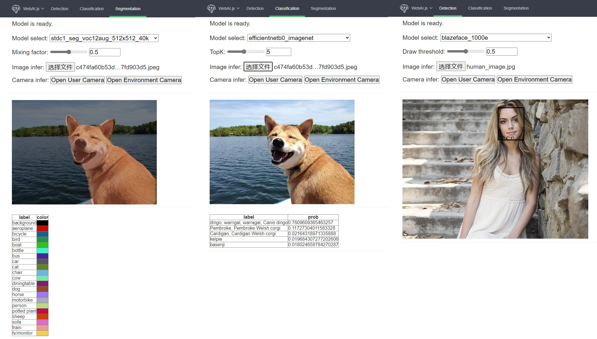

# WebAI.js


[中文版](./docs/tutorials/webai.md) | English

## Online Demo
* [Hello WebAI.js](https://AgentMaker.github.io/WebAI.js)

    

## Features
* Multi-type CV model support

    * [x] Detection models (SSD / YOLO / FCOS / PPYOLO / ...)
    * [x] Classification models (MobileNet / EfficientNet / PPLCNet / ...)
    * [x] Segmentation models (BiseNet / PPSeg / STDC / ...)
    * [ ] OCR models (PPOCR / ...)
    * [ ] more (...)

* Multi-type common CV preprocess OPs support

    * [x] CvtColor (RGBA -> RGB / BGR)
    * [x] Resize
    * [x] Center Crop
    * [x] Normalize
    * [x] Permute (HWC -> CHW)
    * [ ] more (...)

* Rapid deployment of models trained using toolkits

    * [x] [PaddleDetection][PaddleDetection]
    * [x] [PaddleClas][PaddleClas]
    * [x] [PaddleSeg][PaddleSeg]
    * [ ] more (...)


## Requirements
* [OpenCV.js](https://docs.opencv.org/4.5.5/d5/d10/tutorial_js_root.html)
* [ONNXRuntime](https://github.com/microsoft/onnxruntime)

## Usage
* More detailed usage documents and example programs will be updated soon

### Use WebAI.js in a html script
* Install

    ```html
    <!-- Github -->
    <script src='https://cdn.jsdelivr.net/gh/AgentMaker/WebAI.js/dist/webai.min.js'></script>
    <script src='https://cdn.jsdelivr.net/gh/AgentMaker/WebAI.js@(branch)/dist/webai.min.js'></script>

    <!-- Npm -->
    <script src='https://cdn.jsdelivr.net/npm/webai-js/dist/webai.min.js'></script>
    <script src='https://cdn.jsdelivr.net/npm/webai-js@{version}/dist/webai.min.js'></script>
    ```

* APIs

    ```js
    // Create a model
    (async) WebAI.Det.create(modelURL, inferConfig, sessionOption = { logSeverityLevel: 4 }) -> modelDet
    (async) WebAI.Cls.create(modelURL, inferConfig, sessionOption = { logSeverityLevel: 4 }) -> modelCls
    (async) WebAI.Seg.create(modelURL, inferConfig, sessionOption = { logSeverityLevel: 4 }) -> modelSeg

    // Model infer
    (async) modelDet.infer(imgRGBA, drawThreshold=0.5) ->  bboxes
    (async) modelCls.infer(imgRGBA, topK=5) ->  probs
    (async) modelSeg.infer(imgRGBA) ->  segResults

    // Result postprocess
    WebAI.drawBBoxes(img, bboxes, withLabel = true, withScore = true, thickness = 2.0, lineType = 8, fontFace = 0, fontScale = 0.7) -> imgDrawed
    ```

* Simple Demo

    ```html
    <input type="file" accept="image/*" id="inputFile">
    
    <canvas id='canvasDom'></canvas>
    <script src='https://cdn.jsdelivr.net/npm/webai-js/dist/webai.min.js'></script>
    <script>
        // Get HTML elements
        const imgDom = document.getElementById('imgDom')
        const canvasDom = document.getElementById('canvasDom')
        const inputFile = document.getElementById('inputFile')

        // Face detection model files
        const modelURL = 'https://agentmaker.github.io/WebAI.js/pages/pretrained_models/det/blazeface_1000e/model.onnx'
        const modelConfig = 'https://agentmaker.github.io/WebAI.js/pages/pretrained_models/det/blazeface_1000e/configs.json'

        // Detection threshold
        const drawThreshold = 0.5;

        // Load the model
        window.onload = async function (e) {
            window.model = await WebAI.Det.create(modelURL, modelConfig)
        }

        // Set the input image
        inputFile.onchange = function (e) {
            if (e.target.files[0]) {
                imgDom.src = URL.createObjectURL(e.target.files[0])
            }
        }

        // Model infer and show the result image
        imgDom.onload = async function (e) {
            let imgRGBA = cv.imread(imgDom)
            let bboxes = await model.infer(imgRGBA)
            let imgShow = await WebAI.drawBBoxes(imgRGBA, bboxes)
            cv.imshow(canvasDom, imgShow)
            imgRGBA.delete()
            imgShow.delete()
        }
    </script>
    ```

### Use WebAI.js in node.js
* Install

    ```shell
    $ npm install webai-js
    ```

* APIs

    ```js
    // Create a model
    (async) WebAI.Det.create(modelURL, inferConfig, backend='node', sessionOption = { logSeverityLevel: 4 }) -> modelDet
    (async) WebAI.Cls.create(modelURL, inferConfig, backend='node', sessionOption = { logSeverityLevel: 4 }) -> modelCls
    (async) WebAI.Seg.create(modelURL, inferConfig, backend='node', sessionOption = { logSeverityLevel: 4 }) -> modelSeg

    // Model infer
    (async) modelDet.infer(imgRGBA, drawThreshold=0.5) ->  bboxes
    (async) modelCls.infer(imgRGBA, topK=5) ->  probs
    (async) modelSeg.infer(imgRGBA) ->  segResults

    // Image I/O
    (async) WebAI.loadImage(imgPath) -> img
    WebAI.saveImage(img, imgPath)

    // Result postprocess
    WebAI.drawBBoxes(img, bboxes, withLabel = true, withScore = true, thickness = 2.0, lineType = 8, fontFace = 0, fontScale = 0.7) -> imgDrawed
    ```


* Simple Demo (Face Detection)

    ```js
    const WebAI = require('webai-js')
    async function run() {
        // model path
        const modelURL = './docs/pages/pretrained_models/det/blazeface_1000e/model.onnx';
        const modelConfig = './docs/pages/pretrained_models/det/blazeface_1000e/configs.json';

        // run backend: node or web
        const onnxBackend = 'node';

        // detection threshold
        const drawThreshold = 0.5;

        // create model
        const model = await WebAI.Det.create(modelURL, modelConfig, onnxBackend);

        // load the test image
        const image = await WebAI.loadImage('./docs/images/human_image.jpg');

        // model infer
        const bboxes = await model.infer(image, drawThreshold);

        // draw bboxes into the test image
        const imgShow = WebAI.drawBBoxes(image, bboxes, false, true);

        // save result image
        WebAI.saveImage(imgShow, 'test.png');

        // clear cv Mats
        image.delete();
        imgShow.delete();

        // log bboxes result
        console.log(bboxes);
    }
    run()
    ```
        [
            {
                label: 'face',
                color: [ 0, 0, 0, 255 ],
                score: 0.9996205568313599,
                x1: 330,
                y1: 28,
                x2: 418,
                y2: 139
            }
        ]
    

## Model Zoo
* The following pretrained models are provided in the project, and you can quickly try them on the [online experience website](https://AgentMaker.github.io/WebAI.js)
* The pretrained model files can be found in [./docs/pages/pretrained_model](./docs/pages/pretrained_model) directory
* More pretrained models will be added continuously
* The export method of the model will also be updated in the document in the future

    |Model|Type|Source|
    |:-:|:-:|:-:|
    |BlazeFace_1000e|Detection|[PaddleDetection][PaddleDetection]|
    |PPYOLO_tiny_650e_coco|Detection|[PaddleDetection][PaddleDetection]|
    |SSD_mobilenet_v1_300_120e_voc|Detection|[PaddleDetection][PaddleDetection]|
    |SSDLite_mobilenet_v3_small_320_coco|Detection|[PaddleDetection][PaddleDetection]|
    |EfficientNetB0_imagenet|Classification|[PaddleClas][PaddleClas]|
    |MobileNetV3_small_x0_5_imagenet|Classification|[PaddleClas][PaddleClas]|
    |PPLCNet_x0_25_imagenet|Classification|[PaddleClas][PaddleClas]|
    |PPSEG_lite_portrait_398x224|Segmentation|[PaddleSeg][PaddleSeg]|
    |STDC1_seg_voc12aug_512x512_40k|Segmentation|[PaddleSeg][PaddleSeg]|
    |BiseNet_cityscapes_1024x1024_160k|Segmentation|[PaddleSeg][PaddleSeg]|

[PaddleDetection]:https://www.github.com/PaddlePaddle/PaddleDetection
[PaddleClas]:https://www.github.com/PaddlePaddle/PaddleClas
[PaddleSeg]:https://www.github.com/PaddlePaddle/PaddleSeg